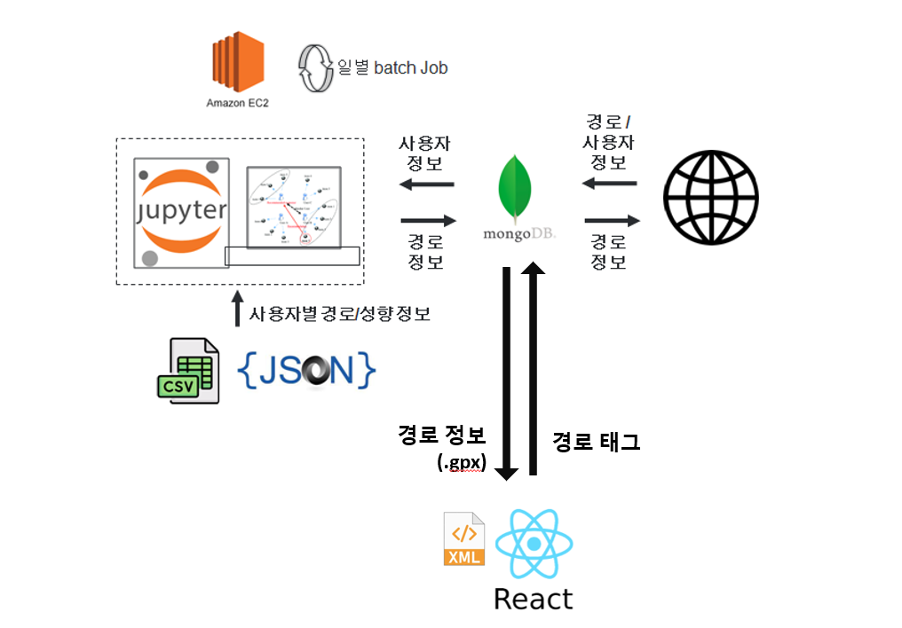
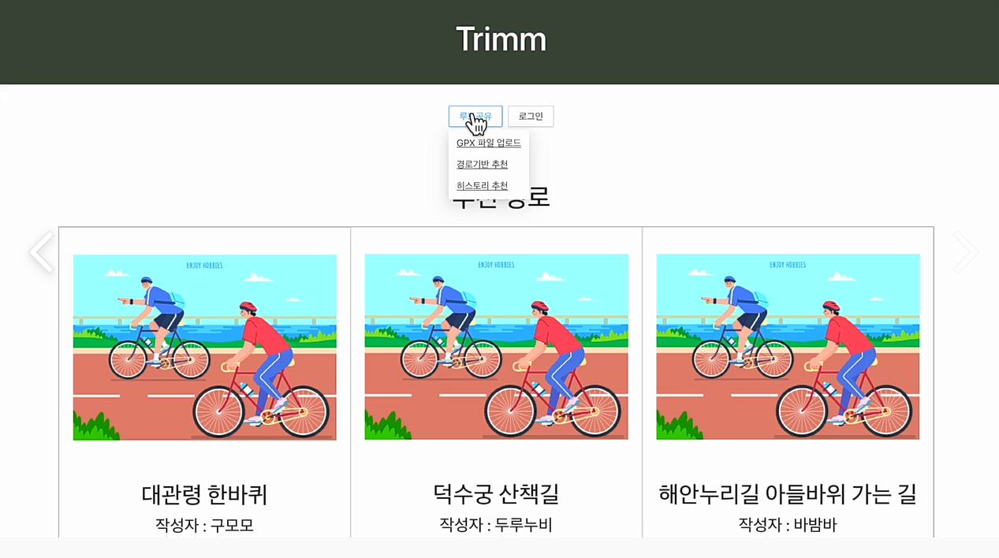
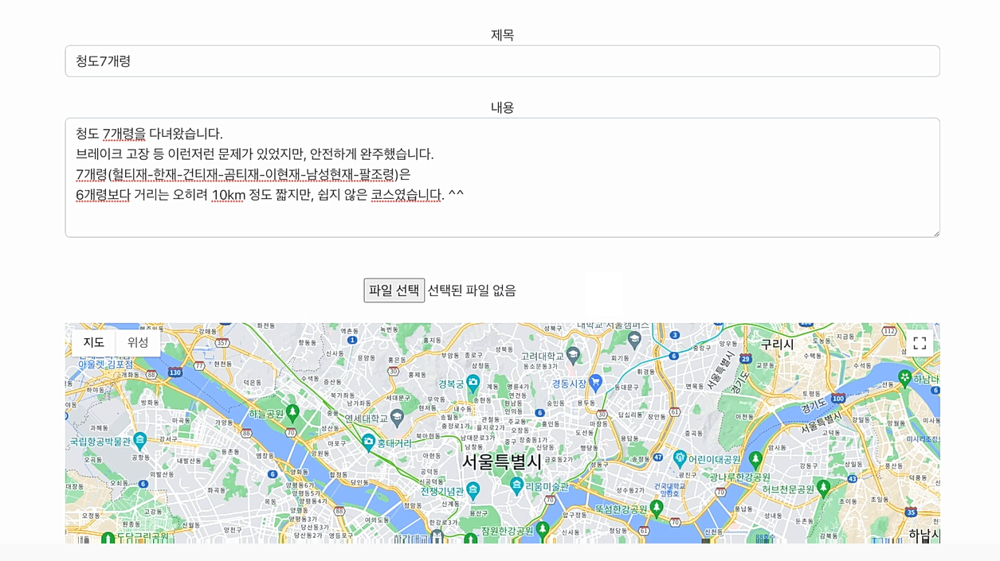
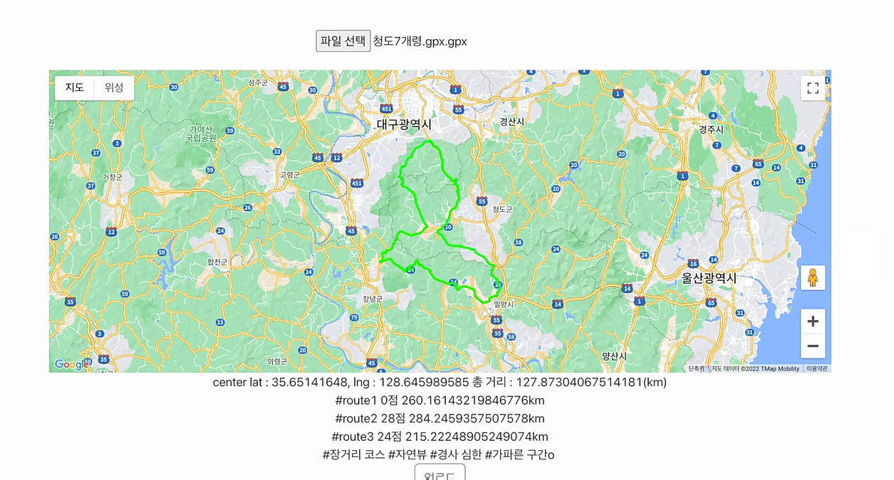
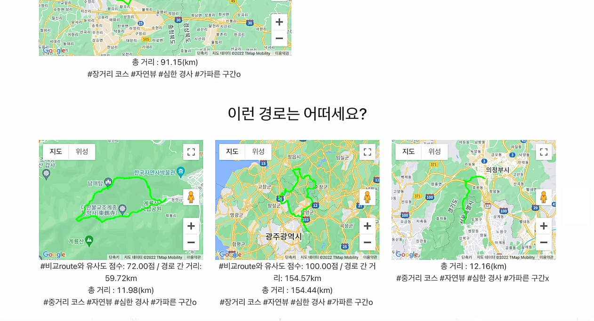
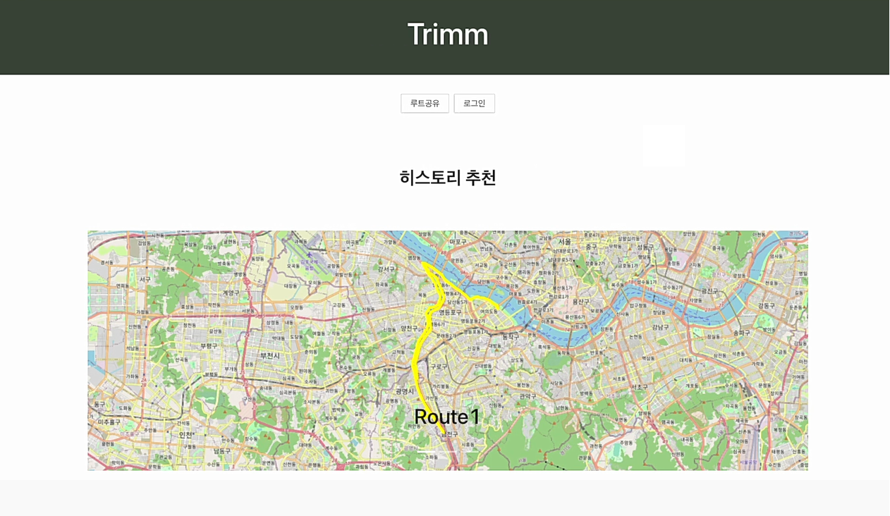

## Project_with_Startup 레이시오

(주)레이시오와 함께 진행한 산학연계 프로젝트입니다.

 

### 프로젝트 내용
사용자&경로 기반 자전거 경로 추천 웹 페이지

 

### 사용한 기술
웹 페이지: JS, React, mongoDB  
사용자 기반 추천 알고리즘: jupyter note, EC2

 

### 시스템 아키텍쳐
 

    

 

### 맡은 역할
#### 프론트 엔드  
구글맵 API위에 경로 파일(.gpx) 출력  
경로 분석 및 추천 태그 출력  
DB에 업로드 된 경로와 사용자 경로 비교 및 유사도 점수 계산  
상세 페이지 조정  

 

### 기술 소개
-경로 기반 추천 과정
1. 경로 분석
    * 경로의 거리, 경사, 위치를 gpx파일을 분석	하여 총 54가지의 태그를 추천

2. 다른 사용자 경로와 분석
    * 사용자가 업로드한 경로와 DB에 있는 경로	와 비교하여 유사한 경로 추천

3. 경로 시각화
    * Google Map 라이브러리를 이용하여 경로	를 지도에 매핑하고, 추천 태그 및 유사도 점	수 출력

 

-사용자의 성향 기반 추천 과정
1. 데이터 전처리
   * 사용자 경로 분석
   * 사용자 성향 파악

2. Collaborative Filtering을 통한 유사 사용자 추출
   * 경로 임베딩 + 성향 임베딩 결합
   * User-based Collaborative Filtering 실행

3. 추출된 유저들의 경로 추출
   
4. 경로 시각화

 

### 결과 화면
[메인 화면]
    

[게시물 작성]
    

[경로 분석]
    

[DB의 경로들과 비교]
    

[사용자 기반 추천 경로]
    
